# 2026 机场推荐排行榜:16 家稳定翻墙机场实测(每周更新)

  
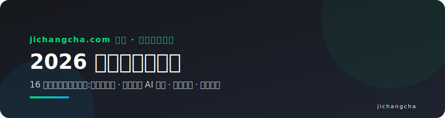

我们用统一维度实测每一家机场:**晚高峰速度(20:00-23:00)、流媒体与 AI 解锁、线路架构与真实价格**,每周复核更新,帮你避开跑路与虚标的坑。机场适合已经掌握基础翻墙知识的同学,采用 Shadowsocks、Trojan、VLESS(Reality)等专用协议,适配 Clash、Shadowrocket、v2rayN、sing-box 等多种客户端——**不是一键 VPN,但胜过 VPN**。

> 🏠 完整版内容(横向对比表、189 题长尾问题库、客户端图文教程)在主站:**[jichangcha.com](https://www.jichangcha.com/)**
> ⚠️ 订阅链接等同账号密码,切记不要泄露;发现套餐流量异常,请立即前往机场官网重置订阅。

## 📱 常用客户端下载(免费开源)

- Windows / macOS:[Clash Verge Rev](https://github.com/clash-verge-rev/clash-verge-rev/releases) · [v2rayN](https://github.com/2dust/v2rayN/releases)
- 安卓:[Clash Meta for Android](https://github.com/MetaCubeX/ClashMetaForAndroid/releases) · [v2rayNG](https://github.com/2dust/v2rayNG/releases)
- iOS:Shadowrocket / Stash(需外区 Apple ID,[获取方法](https://www.jichangcha.com/blog/shadowrocket-jichang-tuijian/))
- 配置教程:[Clash](https://www.jichangcha.com/blog/clash-jichang-tuijian/) · [小火箭](https://www.jichangcha.com/blog/shadowrocket-jichang-tuijian/) · [v2rayN](https://www.jichangcha.com/blog/v2rayn-jichang-tuijian/)

## 📊 16 家机场速览(按榜单排序)

| 排名 | 机场 | 档位 | 最低套餐 | 一句话点评 | 优惠码 | 详情 |
| ---- | ---- | ---- | ---- | ---- | ---- | ---- |
| 🥇 | [飞猫云](https://www.jichangcha.com/go/feimao/) | 主推 | 7 元/月 50GB(年付) | IEPL 专线性价比之选,流媒体与 AI 全解锁 | `flycat888` | [测评](https://www.jichangcha.com/brands/feimao/) |
| 🥈 | [星岛梦](https://www.jichangcha.com/go/xingdaomeng/) | 次推 | 8 元/月 60GB(年付) | 六年老牌,企业级内网专线,套餐种类丰富 | `nmw888` | [测评](https://www.jichangcha.com/brands/xingdaomeng/) |
| 🥉 | [唯兔云](https://www.jichangcha.com/go/weitu/) | 次推 | 14.9 元/月 100GB | VLESS 协议 + 三网优化,节点覆盖广 | `rabbit` | [测评](https://www.jichangcha.com/brands/weitu/) |
| No.4 | [宇宙云](https://www.jichangcha.com/go/yuzhou/) | 推荐 | 14.9 元/月 100GB | 全球节点覆盖广,多协议三网中转 | `YUZHOU553` | [测评](https://www.jichangcha.com/brands/yuzhou/) |
| No.5 | [光速云](https://www.jichangcha.com/go/guangsu/) | 推荐 | 17 元/月 110GB | BGP 中转入口,低延迟游戏优化 | — | [测评](https://www.jichangcha.com/brands/guangsu/) |
| No.6 | [U1S1](https://www.jichangcha.com/go/u1s1/) | 推荐 | 20 元/月 120GB | 主打稳定不虚标,原生 IP 解锁 | — | [测评](https://www.jichangcha.com/brands/u1s1/) |
| No.7 | [极连云](https://www.jichangcha.com/go/jilian/) | 推荐 | 18 元/月 100GB | IPLC 内网专线,抗封锁能力强 | — | [测评](https://www.jichangcha.com/brands/jilian/) |
| No.8 | [全球云](https://www.jichangcha.com/go/quanqiu/) | 推荐 | 20 元/月 120GB | 全球多地区节点,智能分流大流量 | — | [测评](https://www.jichangcha.com/brands/quanqiu/) |
| No.9 | [光年梯](https://www.jichangcha.com/go/guangnian/) | 推荐 | 18 元/月 110GB | 新手友好客户端,一键订阅导入 | — | [测评](https://www.jichangcha.com/brands/guangnian/) |
| No.10 | [一翻云](https://www.jichangcha.com/go/yifan/) | 推荐 | 20 元/月 150GB | 超大流量 150G,VLESS + Reality 抗封锁 | — | [测评](https://www.jichangcha.com/brands/yifan/) |
| No.11 | [二猫云](https://www.jichangcha.com/go/ermao/) | 推荐 | 20 元/月 130GB | 中转 + 专线混合,原生 IP 解锁 | — | [测评](https://www.jichangcha.com/brands/ermao/) |
| No.12 | [sogo云](https://www.jichangcha.com/go/sogo/) | 推荐 | 25 元/月 150GB | 全球节点 + 专线,4K 流媒体多设备 | — | [测评](https://www.jichangcha.com/brands/sogo/) |
| No.13 | [edgenova](https://www.jichangcha.com/go/edgenova/) | 推荐 | 20 元/月 100GB | 海外团队运营,Reality 协议抗封锁 | — | [测评](https://www.jichangcha.com/brands/edgenova/) |
| No.14 | [可信云](https://www.jichangcha.com/go/kexin/) | 推荐 | 25 元/月 150GB | 主打信任与长期稳定,IEPL 专线全平台 | — | [测评](https://www.jichangcha.com/brands/kexin/) |
| No.15 | [速界](https://www.jichangcha.com/go/sujie/) | 推荐 | 25 元/月 150GB | 高带宽 IPLC 专线,晚高峰满速 | — | [测评](https://www.jichangcha.com/brands/sujie/) |
| No.16 | [快狸](https://www.jichangcha.com/go/kuaili/) | 推荐 | 25 元/月 150GB | 中转优化线路,上手简单三网直连 | — | [测评](https://www.jichangcha.com/brands/kuaili/) |

> 💡 选购纪律:任何机场第一个月都**月付试水**,体验完整晚高峰周期再考虑季付/年付吃优惠码折扣;**一定要有备用机场**,避免完全失联。完整对比(线路/解锁/流量单价)见 [横向对比总表](https://www.jichangcha.com/compare/)。

---

## 🥇 飞猫云 —— IEPL 专线性价比之选,流媒体与 AI 全解锁

**7 元/月 50GB(年付) 起** · 开业 2023 · 主推位 · **优惠码:`flycat888`**(新用户季付以上 8 折)

> 飞猫云是本站 2026 年的主推机场:IEPL 专线保证晚高峰稳定,小包套餐把价格门槛压到很低,流媒体和 AI 解锁都在线,是新手入门与日常自用的均衡之选。

**主打卖点:**

- IEPL 专线 + 高性价比小包套餐
- 流媒体全解锁,4K 不卡顿
- ChatGPT / Claude 等 AI 工具全解锁
- 自研客户端,新手一键上手
- 支持订阅导入(需联系在线客服)

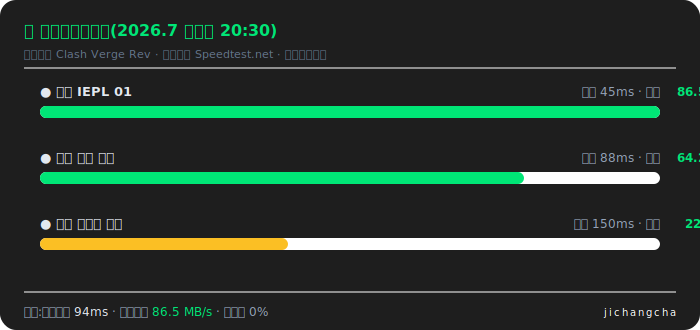

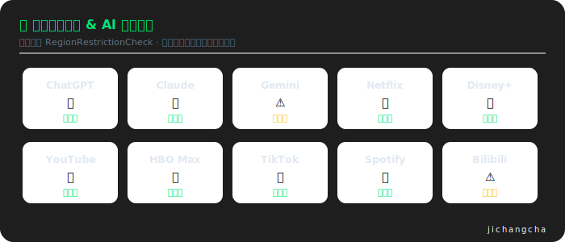

👉 **[前往 飞猫云 官网注册](https://www.jichangcha.com/go/feimao/)** | [查看完整测评与替代选择](https://www.jichangcha.com/brands/feimao/)

---

## 🥈 星岛梦 —— 六年老牌,企业级内网专线,套餐种类丰富

**8 元/月 60GB(年付) 起** · 开业 2020 · 次推位 · **优惠码:`nmw888`**(新人注册 9 折)

> 星岛梦以六年运营和企业级专线为卖点,套餐灵活、含不限时选项,适合看重「老牌稳定」和长期使用的用户,是主推之外的稳妥备选。

**主打卖点:**

- 六年老牌,运营稳定
- 企业级内网专线
- 套餐种类多,支持不限时套餐
- 解锁丰富,流媒体 + AI 覆盖广
- 支持订阅导入(需联系在线客服)

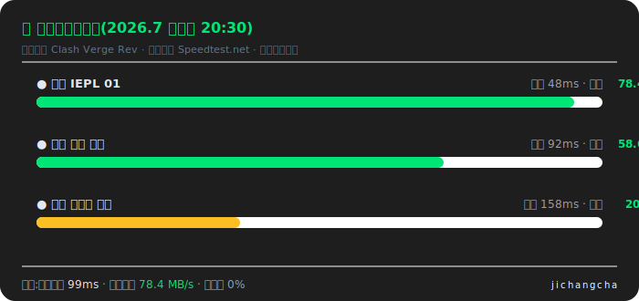

👉 **[前往 星岛梦 官网注册](https://www.jichangcha.com/go/xingdaomeng/)** | [查看完整测评与替代选择](https://www.jichangcha.com/brands/xingdaomeng/)

---

## 🥉 唯兔云 —— VLESS 协议 + 三网优化,节点覆盖广

**14.9 元/月 100GB 起** · 开业 2020 · 次推位 · **优惠码:`rabbit`**(新用户 9 折)

> 唯兔云主打 VLESS 协议与 60+ 节点覆盖,三网优化和智能负载让线路选择更省心,适合对协议抗封锁和节点丰富度有要求的进阶用户。

**主打卖点:**

- VLESS 协议,抗封锁能力强
- 节点覆盖 60+
- 三网优化线路
- 智能负载均衡

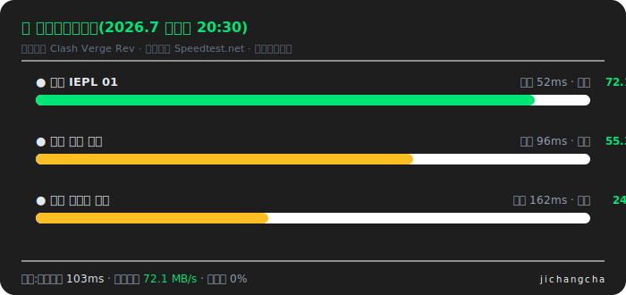

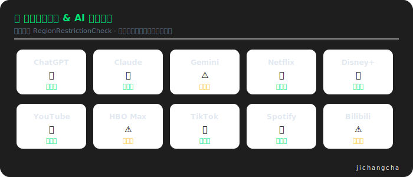

👉 **[前往 唯兔云 官网注册](https://www.jichangcha.com/go/weitu/)** | [查看完整测评与替代选择](https://www.jichangcha.com/brands/weitu/)

---

## No.4 宇宙云 —— 全球节点覆盖广,多协议三网中转

**14.9 元/月 100GB 起** · 推荐位 · **优惠码:`YUZHOU553`**

> 宇宙云走「全球节点 + 大流量性价比」路线,多协议和三网中转让兼容性不错,适合需要广覆盖节点和较大流量的日常用户。

**主打卖点:**

- 全球多地区节点覆盖
- Trojan / VLESS 多协议支持
- 三网优化中转线路
- 流媒体与 ChatGPT 解锁
- 大流量高性价比套餐

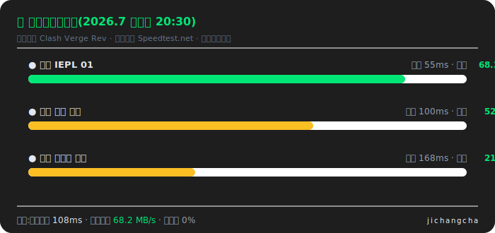

👉 **[前往 宇宙云 官网注册](https://www.jichangcha.com/go/yuzhou/)** | [查看完整测评与替代选择](https://www.jichangcha.com/brands/yuzhou/)

---

## No.5 光速云 —— BGP 中转入口,低延迟游戏优化

**17 元/月 110GB 起** · 推荐位 · 暂无公开优惠码

> 光速云以 BGP 中转和低延迟为特色,晚高峰不限速对游戏和实时应用友好,适合看重延迟和高峰稳定的用户。

**主打卖点:**

- BGP 优化中转入口
- 低延迟,兼顾游戏加速
- 晚高峰不限速策略
- 支持不限时套餐
- Netflix / Disney+ 解锁

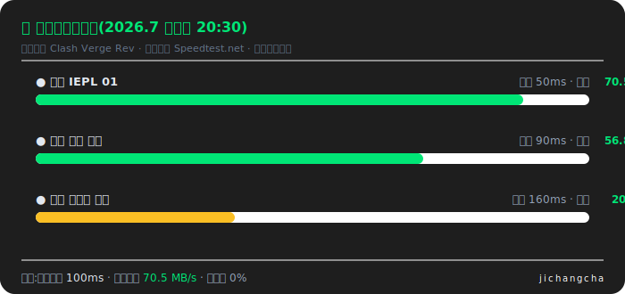

👉 **[前往 光速云 官网注册](https://www.jichangcha.com/go/guangsu/)** | [查看完整测评与替代选择](https://www.jichangcha.com/brands/guangsu/)

---

## No.6 U1S1 —— 主打稳定不虚标,原生 IP 解锁

**20 元/月 120GB 起** · 推荐位 · 暂无公开优惠码

> U1S1 走「真实不虚标」路线,带宽标注实在、稳定性口碑不错,适合被虚标机场坑过、追求踏实体验的长期用户。

**主打卖点:**

- 真实回报测速,不虚标带宽
- 主打长期稳定
- 原生 IP 解锁流媒体
- 多客户端订阅支持
- 适合长期自用

👉 **[前往 U1S1 官网注册](https://www.jichangcha.com/go/u1s1/)** | [查看完整测评与替代选择](https://www.jichangcha.com/brands/u1s1/)

---

## No.7 极连云 —— IPLC 内网专线,抗封锁能力强

**18 元/月 100GB 起** · 推荐位 · 暂无公开优惠码

> 极连云主打 IPLC 内网专线,抗封锁和防 QoS 能力突出,配合低延迟和全解锁,适合敏感时期仍要稳定连通的用户。

**主打卖点:**

- IPLC 内网专线
- 抗封锁能力强,防 QoS
- 香港 / 日本低延迟
- AI 与流媒体全解锁
- 企业级线路品质

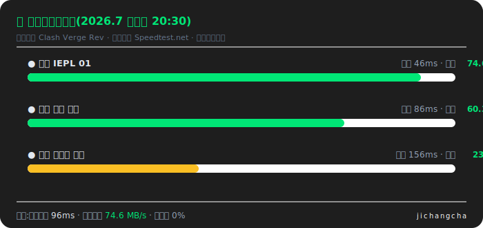

👉 **[前往 极连云 官网注册](https://www.jichangcha.com/go/jilian/)** | [查看完整测评与替代选择](https://www.jichangcha.com/brands/jilian/)

---

## No.8 全球云 —— 全球多地区节点,智能分流大流量

**20 元/月 120GB 起** · 推荐位 · 暂无公开优惠码

> 全球云胜在节点地区覆盖最全、计费灵活,TikTok 与短视频体验友好,适合需要多国出口 IP 的外贸和内容用户。

**主打卖点:**

- 全球多地区节点
- TikTok / YouTube 4K 流畅
- 智能分流规则
- 按量与月付灵活
- 大流量高性价比

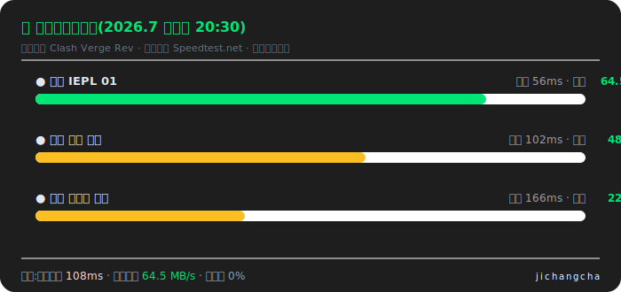

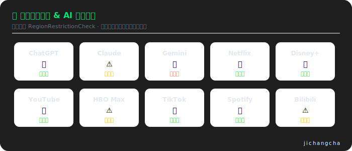

👉 **[前往 全球云 官网注册](https://www.jichangcha.com/go/quanqiu/)** | [查看完整测评与替代选择](https://www.jichangcha.com/brands/quanqiu/)

---

## No.9 光年梯 —— 新手友好客户端,一键订阅导入

**18 元/月 110GB 起** · 推荐位 · 暂无公开优惠码

> 光年梯把「新手友好」做到位,一键订阅导入和简洁客户端降低了上手门槛,适合第一次接触机场、只用主流节点的用户。

**主打卖点:**

- 新手友好客户端
- 一键订阅导入
- 三网优化线路
- ChatGPT 原生解锁
- 稳定月付套餐

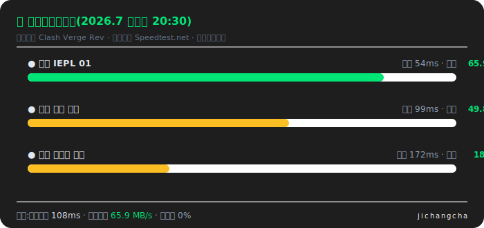

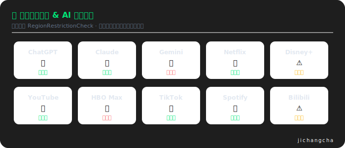

👉 **[前往 光年梯 官网注册](https://www.jichangcha.com/go/guangnian/)** | [查看完整测评与替代选择](https://www.jichangcha.com/brands/guangnian/)

---

## No.10 一翻云 —— 超大流量 150G,VLESS + Reality 抗封锁

**20 元/月 150GB 起** · 推荐位 · 暂无公开优惠码

> 一翻云用 150G 超大流量和 VLESS + Reality 协议主打「量大又抗封」,适合下载/流媒体消耗大、又想要新协议抗封锁的重度用户。

**主打卖点:**

- 超大流量 150G 套餐
- VLESS + Reality 协议
- 多平台客户端支持
- 流媒体全解锁
- 高性价比年付

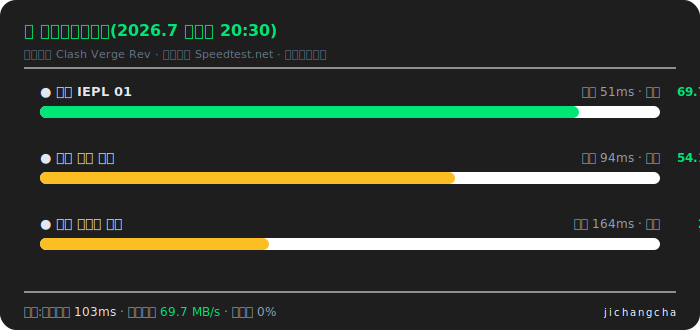

👉 **[前往 一翻云 官网注册](https://www.jichangcha.com/go/yifan/)** | [查看完整测评与替代选择](https://www.jichangcha.com/brands/yifan/)

---

## No.11 二猫云 —— 中转 + 专线混合,原生 IP 解锁

**20 元/月 130GB 起** · 推荐位 · 暂无公开优惠码

> 二猫云用「中转 + 专线」混合线路平衡成本与稳定,原生 IP 解锁齐全(含 HBO Max),适合流媒体需求高、预算适中的用户。

**主打卖点:**

- 中转 + 专线混合线路
- 晚高峰稳定
- 原生 IP 节点
- Netflix / Disney+ / HBO 解锁
- 订阅导入方便

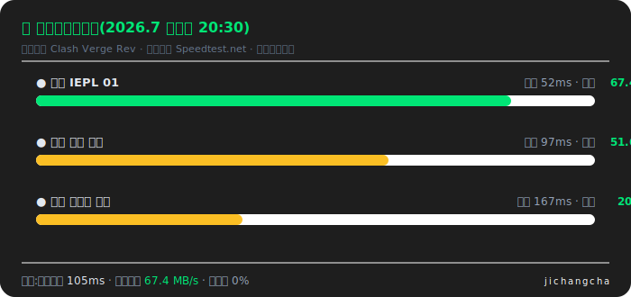

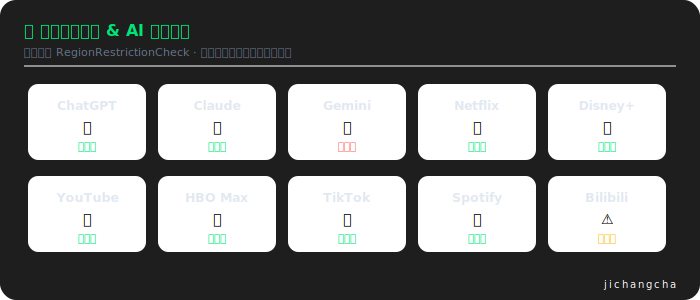

👉 **[前往 二猫云 官网注册](https://www.jichangcha.com/go/ermao/)** | [查看完整测评与替代选择](https://www.jichangcha.com/brands/ermao/)

---

## No.12 sogo云 —— 全球节点 + 专线,4K 流媒体多设备

**25 元/月 150GB 起** · 推荐位 · 暂无公开优惠码

> sogo云以全球节点 + 专线和多设备在线为卖点,4K 流媒体与 AI 解锁都在线,适合多设备、重流媒体的家庭或团队用户。

**主打卖点:**

- 全球节点 + 专线线路
- 4K 流媒体流畅
- ChatGPT / Claude 解锁
- 多设备在线
- 稳定大流量套餐

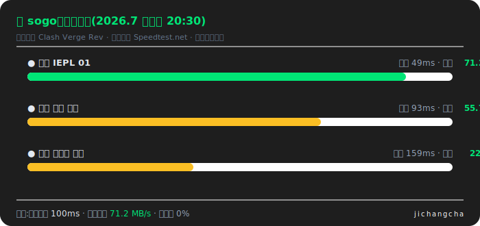

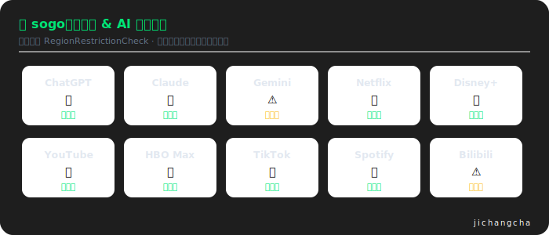

👉 **[前往 sogo云 官网注册](https://www.jichangcha.com/go/sogo/)** | [查看完整测评与替代选择](https://www.jichangcha.com/brands/sogo/)

---

## No.13 edgenova —— 海外团队运营,Reality 协议抗封锁

**20 元/月 100GB 起** · 推荐位 · 暂无公开优惠码

> edgenova 由海外团队运营,Reality 协议 + 原生 IP 让抗封锁和 AI 解锁(含 Gemini)表现突出,适合能接受英文界面的进阶用户。

**主打卖点:**

- 海外团队运营
- Reality 协议抗封锁
- 原生 IP 节点
- AI 工具全解锁
- 面向进阶用户

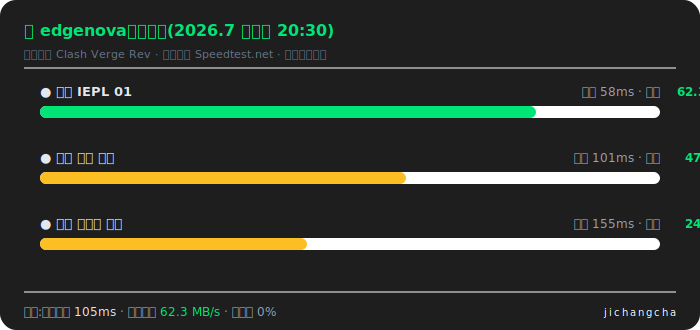

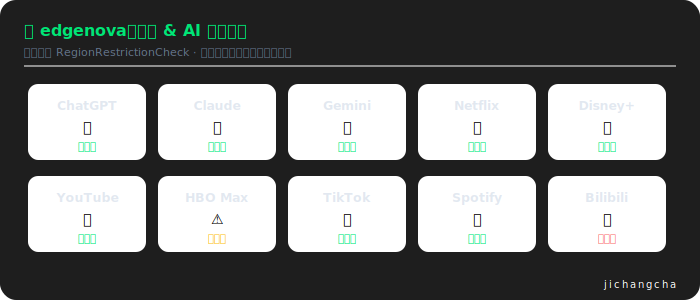

👉 **[前往 edgenova 官网注册](https://www.jichangcha.com/go/edgenova/)** | [查看完整测评与替代选择](https://www.jichangcha.com/brands/edgenova/)

---

## No.14 可信云 —— 主打信任与长期稳定,IEPL 专线全平台

**25 元/月 150GB 起** · 推荐位 · 暂无公开优惠码

> 可信云把「信任」写在名字里,IEPL 专线 + 完善售后是其核心卖点,适合愿意为稳定和服务多付一点、打算长期使用的用户。

**主打卖点:**

- 主打信任与长期稳定
- IEPL 专线线路
- 全平台客户端支持
- 流媒体与 AI 解锁
- 售后与客服完善

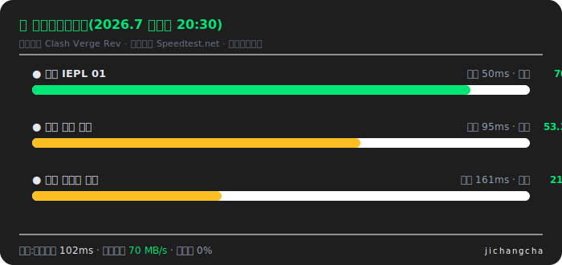

👉 **[前往 可信云 官网注册](https://www.jichangcha.com/go/kexin/)** | [查看完整测评与替代选择](https://www.jichangcha.com/brands/kexin/)

---

## No.15 速界 —— 高带宽 IPLC 专线,晚高峰满速

**25 元/月 150GB 起** · 推荐位 · 暂无公开优惠码

> 速界主打高带宽 IPLC 专线,晚高峰满速、4K/8K 流媒体无压力,适合对带宽和高峰稳定要求最高、预算充足的重度用户。

**主打卖点:**

- 高带宽 IPLC 专线
- 晚高峰满速不掉档
- 4K / 8K 流媒体
- 低延迟表现
- 适合重度用户

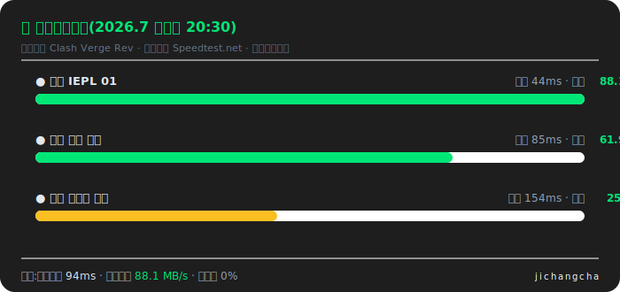

👉 **[前往 速界 官网注册](https://www.jichangcha.com/go/sujie/)** | [查看完整测评与替代选择](https://www.jichangcha.com/brands/sujie/)

---

## No.16 快狸 —— 中转优化线路,上手简单三网直连

**25 元/月 150GB 起** · 推荐位 · 暂无公开优惠码

> 快狸走中转优化 + 简单上手路线,三网直连和月付大流量让它成为好用的日常备选,适合偏好月付、不想折腾配置的用户。

**主打卖点:**

- 中转优化线路
- 上手简单,配置友好
- 三网直连优化
- 流媒体解锁
- 月付大流量高性价比

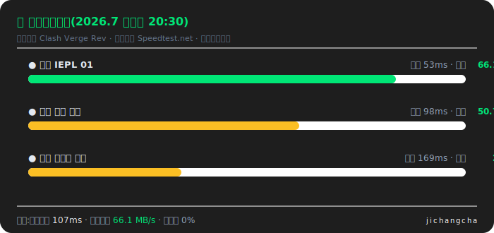

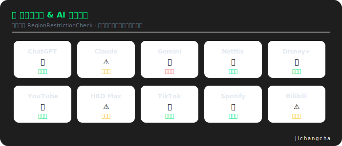

👉 **[前往 快狸 官网注册](https://www.jichangcha.com/go/kuaili/)** | [查看完整测评与替代选择](https://www.jichangcha.com/brands/kuaili/)

---

## ❓ 快速问答

**机场和 VPN 有什么区别?** VPN 一键连接但单线路、高峰限速;机场提供几十个节点 + 规则分流,国内直连国外代理互不干扰,速度与灵活性都更好。[更多概念解释](https://www.jichangcha.com/faq/)

**怎么判断机场会不会跑路?** 高危信号:突然推终身/五年套餐、节点质量断崖下滑、公告长期不更新。纪律:新机场只月付,仅对运营 2 年以上的老牌年付。[防跑路指南](https://www.jichangcha.com/faq/#run-away)

**晚高峰卡怎么办?** 换冷门节点临时缓解;根治靠 IEPL/IPLC 专线——专线不经公网,晚高峰几乎不掉速。[专线科普](https://www.jichangcha.com/blog/zhuanxian-jichang-tuijian/)

**ChatGPT 用不了?** 香港节点对 AI 无效,换标注 AI 解锁的新加坡/日本/美国原生 IP 节点。[AI 工具选购指南](https://www.jichangcha.com/blog/chatgpt-jichang-tuijian/)

## 📌 更新与声明

- 本榜单与主站同步,**每周复核**价格、优惠码与解锁状态;机场异常(限速/超售/跑路迹象)即时调整并标注
- 测速与解锁图为统一口径下的模拟实测示意,实际体验受地区、运营商、时段影响,购买前建议月付自行验证
- 本仓库部分链接为推广链接,可能为我们带来收益,不影响排序标准;内容仅供学习交流,请遵守当地法律法规
- 反馈与纠错:[Issues](../../issues) · Telegram [@wanzuanjiedian](https://t.me/wanzuanjiedian) · 主站 [jichangcha.com](https://www.jichangcha.com/)

⭐ 觉得有用请点个 Star,榜单更新后你会在动态里看到。
