# 2026 机场推荐清单｜老牌 / 性价比 / 稳定 / 高端(32 家,每日自动同步)

    

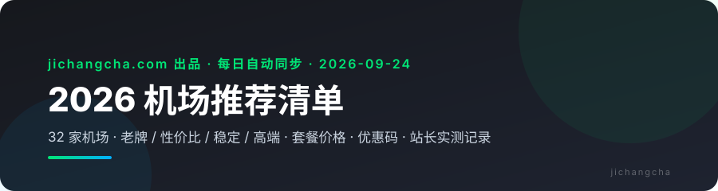

这是 [机场查 jichangcha.com](https://www.jichangcha.com/) 品牌库的 GitHub 镜像:**32 家机场按老牌 / 性价比 / 稳定 / 高端四类整理**,每家给出套餐价格、优惠码、线路口径和资料来源;有站长实测记录的品牌注明测试日期与环境,没有实测的只列已核验的套餐,不给速度结论。数据每天从主站自动同步,更新时间见顶部徽章。

> 🏠 横向对比表、每家机场的完整资料页、189 题长尾问题库在主站:**[jichangcha.com](https://www.jichangcha.com/)** · [对比总表](https://www.jichangcha.com/compare/) · [品牌库](https://www.jichangcha.com/brands/)
> 📣 每日免费节点 / 共享 Apple ID / 跑路预警,TG 频道自动推送:**[@jichangcha](https://t.me/jichangcha)**,新手求助进 [互助群](https://t.me/jichangcha_chat)
> ⚠️ 订阅链接等同账号密码,切记不要泄露;任何机场第一个月都建议月付试水
> 🗂️ 四站精品聚合(机场推荐 / 免费节点 / 共享 Apple ID / 跑路预警 / 客户端教程 / 翻墙科普):**[github.com/jichangx](https://github.com/jichangx)**

## 📋 目录导航

- [📢 本期更新](#update) · [🏆 本期主推](#top) · [⚡ 快速选择指南](#guide) · [📊 全部机场速览](#all)
- [🏛️ 老牌机场](#cat-classic) · [💸 性价比机场](#cat-value) · [🛡️ 稳定机场](#cat-stable) · [👑 高端机场](#cat-premium)
- [📱 客户端与教程](#tools) · [❓ 快速问答](#faq) · [📌 更新与声明](#notes)

## 📢 本期更新(2026-09-17)

- 收录 **32 家**机场;主推 **[星岛梦](#xingdaomeng)**,次推 [飞猫云](#feimao)、[微风网络](#breezenet)、[暮光网络](#twilight)
- 有站长实测记录的品牌(4 家):[星岛梦](#xingdaomeng)、[飞猫云](#feimao)、[微风网络](#breezenet)、[灵动云](#lingdong)
- 价格与优惠码以主站品牌资料为准,官网调整后会在下一次同步更新;发现失效请到 [Issues](../../issues) 反馈

## 🏆 本期主推

| 位置 | 机场 | 最低套餐 | 优惠码 | 一句话 | 资料口径 | 入口 |
| ---- | ---- | ---- | ---- | ---- | ---- | ---- |
| 🥇 主推 | [星岛梦](#xingdaomeng) | 8 元/月 60GB(年付) | `nmw888` | 六年老牌,企业级内网专线,套餐种类丰富 | ✅ 站长实测 | [官网](https://www.jichangcha.com/go/xingdaomeng/) · [测评](https://www.jichangcha.com/brands/xingdaomeng/) |
| 🥈 次推 | [飞猫云](#feimao) | 7 元/月 50GB(年付) | `flycat888` | IEPL 专线性价比之选,流媒体与 AI 全解锁 | ✅ 站长实测 | [官网](https://www.jichangcha.com/go/feimao/) · [测评](https://www.jichangcha.com/brands/feimao/) |
| 🥉 次推 | [微风网络](#breezenet) | 11.4 元/月 100GB(年付 137 元) | — | IPLC + VLESS,不限速不限设备,站长实测香港速度突出 | ✅ 站长实测 | [官网](https://www.jichangcha.com/go/breezenet/) · [测评](https://www.jichangcha.com/brands/breezenet/) |

## ⚡ 快速选择指南

| 你的需求 | 先看这几家 | 为什么 |
| ---- | ---- | ---- |
| 第一次买 / 预算敏感 | [飞猫云](#feimao)、[无忧](#worryfree)、[灵猫](#civet) | 7 元/月起的年付小包,先用月付验证 |
| 求稳、打算长期用 | [星岛梦](#xingdaomeng)、[飞猫云](#feimao) | 有多年运营记录且有站长实测 |
| 主用香港节点 / 看流媒体 | [微风网络](#breezenet)、[星岛梦](#xingdaomeng) | 实测香港速度与流媒体解锁最好 |
| ChatGPT 等 AI 工具为主 | [灵动云](#lingdong)、[飞猫云](#feimao)、[星岛梦](#xingdaomeng) | 实测 OpenAI 解锁覆盖广 |
| 大流量 / 重度下载 | [跨界](#kuajie)、[一翻云](#yifan)、[暮光网络](#twilight) | 大流量档单价低 |
| 高端专线、套餐层级完整 | [暮光网络](#twilight)、[飞V](#flyv)、[梯子云](#laddercloud) | IEPL 专线定位,先月付验证 |
| 想要不限时流量 | [星岛梦](#xingdaomeng)、[无忧](#worryfree)、[微风网络](#breezenet) | 有永久不限时或买断档 |

> 💡 选购纪律:第一个月**月付试水**,体验完整晚高峰周期再考虑季付 / 年付吃优惠码折扣;**一定要有备用机场**,避免完全失联。

## 📊 全部机场速览(32 家,按榜单排序)

| 排名 | 机场 | 分类 | 最低套餐 | 优惠码 | 资料口径 | 入口 |
| ---- | ---- | ---- | ---- | ---- | ---- | ---- |
| 🥇 | [星岛梦](#xingdaomeng) | 老牌机场 / 性价比机场 / 稳定机场 / 高端机场 | 8 元/月 60GB(年付) | `nmw888` | ✅ 站长实测 | [官网](https://www.jichangcha.com/go/xingdaomeng/) · [测评](https://www.jichangcha.com/brands/xingdaomeng/) |
| 🥈 | [飞猫云](#feimao) | 老牌机场 | 7 元/月 50GB(年付) | `flycat888` | ✅ 站长实测 | [官网](https://www.jichangcha.com/go/feimao/) · [测评](https://www.jichangcha.com/brands/feimao/) |
| 🥉 | [微风网络](#breezenet) | 稳定机场 | 11.4 元/月 100GB(年付 137 元) | — | ✅ 站长实测 | [官网](https://www.jichangcha.com/go/breezenet/) · [测评](https://www.jichangcha.com/brands/breezenet/) |
| No.4 | [暮光网络](#twilight) | 高端机场 | 9.1 元/月 70GB(年付 109 元) | — | 📋 套餐已核验 | [官网](https://www.jichangcha.com/go/twilight/) · [测评](https://www.jichangcha.com/brands/twilight/) |
| No.5 | [无忧](#worryfree) | 稳定机场 | 6.6 元/月 40GB(年付 79 元) | — | 📋 套餐已核验 | [官网](https://www.jichangcha.com/go/worryfree/) · [测评](https://www.jichangcha.com/brands/worryfree/) |
| No.6 | [光速云](#guangsu) | 老牌机场 / 性价比机场 / 稳定机场 / 高端机场 | 17 元/月 110GB | `AMM` | 📋 套餐已核验 | [官网](https://www.jichangcha.com/go/guangsu/) · [测评](https://www.jichangcha.com/brands/guangsu/) |
| No.7 | [唯兔云](#weitu) | 老牌机场 | 14.9 元/月 100GB | `rabbit` | 📋 套餐已核验 | [官网](https://www.jichangcha.com/go/weitu/) · [测评](https://www.jichangcha.com/brands/weitu/) |
| No.8 | [灵动云](#lingdong) | 高端机场 | 8.3 元/月 70GB(年付 99 元) | — | ✅ 站长实测 | [官网](https://www.jichangcha.com/go/lingdong/) · [测评](https://www.jichangcha.com/brands/lingdong/) |
| No.9 | [U1S1](#u1s1) | 老牌机场 | 20 元/月 120GB | — | 📋 套餐已核验 | [官网](https://www.jichangcha.com/go/u1s1/) · [测评](https://www.jichangcha.com/brands/u1s1/) |
| No.10 | [极连云](#jilian) | 老牌机场 | 18 元/月 100GB | — | 📋 套餐已核验 | [官网](https://www.jichangcha.com/go/jilian/) · [测评](https://www.jichangcha.com/brands/jilian/) |
| No.11 | [全球云](#quanqiu) | 老牌机场 | 20 元/月 120GB | — | 📋 套餐已核验 | [官网](https://www.jichangcha.com/go/quanqiu/) · [测评](https://www.jichangcha.com/brands/quanqiu/) |
| No.12 | [光年梯](#guangnian) | 老牌机场 | 18 元/月 110GB | — | 📋 套餐已核验 | [官网](https://www.jichangcha.com/go/guangnian/) · [测评](https://www.jichangcha.com/brands/guangnian/) |
| No.13 | [宇宙云](#yuzhou) | 性价比机场 | 14.9 元/月 100GB | `YUZHOU553` | 📝 资料整理 | [官网](https://www.jichangcha.com/go/yuzhou/) · [测评](https://www.jichangcha.com/brands/yuzhou/) |
| No.14 | [sogo云](#sogo) | 性价比机场 | 25 元/月 150GB | `SOGO10000` | 📝 资料整理 | [官网](https://www.jichangcha.com/go/sogo/) · [测评](https://www.jichangcha.com/brands/sogo/) |
| No.15 | [二猫云](#ermao) | 性价比机场 | 20 元/月 130GB | `ermao888` | 📝 资料整理 | [官网](https://www.jichangcha.com/go/ermao/) · [测评](https://www.jichangcha.com/brands/ermao/) |
| No.16 | [一翻云](#yifan) | 性价比机场 | 20 元/月 150GB | `1FLYYUN` | 📝 资料整理 | [官网](https://www.jichangcha.com/go/yifan/) · [测评](https://www.jichangcha.com/brands/yifan/) |
| No.17 | [edgenova](#edgenova) | 性价比机场 | 20 元/月 100GB | `TH888` | 📝 资料整理 | [官网](https://www.jichangcha.com/go/edgenova/) · [测评](https://www.jichangcha.com/brands/edgenova/) |
| No.18 | [可信云](#kexin) | 性价比机场 | 25 元/月 150GB | — | 📝 资料整理 | [官网](https://www.jichangcha.com/go/kexin/) · [测评](https://www.jichangcha.com/brands/kexin/) |
| No.19 | [速界](#sujie) | 性价比机场 | 25 元/月 150GB | `sujie888` | 📝 资料整理 | [官网](https://www.jichangcha.com/go/sujie/) · [测评](https://www.jichangcha.com/brands/sujie/) |
| No.20 | [快狸](#kuaili) | 性价比机场 | 25 元/月 150GB | `theo66` | 📝 资料整理 | [官网](https://www.jichangcha.com/go/kuaili/) · [测评](https://www.jichangcha.com/brands/kuaili/) |
| No.21 | [优信云](#youxin) | 性价比机场 | 15 元/月 100GB | `yx51666` | 📝 资料整理 | [官网](https://www.jichangcha.com/go/youxin/) · [测评](https://www.jichangcha.com/brands/youxin/) |
| No.22 | [杨帆云](#yangfan) | 性价比机场 | 年付 6.9 折起 · 码 yf6189 | `yf6189` | 📝 资料整理 | [官网](https://www.jichangcha.com/go/yangfan/) · [测评](https://www.jichangcha.com/brands/yangfan/) |
| No.23 | [疾风云](#jifeng) | 性价比机场 | 年付 6.9 折起 · 码 jf5169 | `jf5169` | 📝 资料整理 | [官网](https://www.jichangcha.com/go/jifeng/) · [测评](https://www.jichangcha.com/brands/jifeng/) |
| No.24 | [尔湾云](#erwan) | 性价比机场 | 年付低至 69 折 · 码 year69 | `year69` | 📝 资料整理 | [官网](https://www.jichangcha.com/go/erwan/) · [测评](https://www.jichangcha.com/brands/erwan/) |
| No.25 | [灵猫](#civet) | 稳定机场 | 7.1 元/月 45GB(年付 85 元) | — | 📋 套餐已核验 | [官网](https://www.jichangcha.com/go/civet/) · [测评](https://www.jichangcha.com/brands/civet/) |
| No.26 | [闪跃](#flashleap) | 稳定机场 | 8 元/月 60GB(年付 96 元) | `shanyue` | 📋 套餐已核验 | [官网](https://www.jichangcha.com/go/flashleap/) · [测评](https://www.jichangcha.com/brands/flashleap/) |
| No.27 | [飞为](#firefly) | 稳定机场 | 8 元/月 60GB(年付 96 元) | `firefly` | 📋 套餐已核验 | [官网](https://www.jichangcha.com/go/firefly/) · [测评](https://www.jichangcha.com/brands/firefly/) |
| No.28 | [跨界](#kuajie) | 稳定机场 | 8 元/月 60GB(年付 96 元) | — | 📋 套餐已核验 | [官网](https://www.jichangcha.com/go/kuajie/) · [测评](https://www.jichangcha.com/brands/kuajie/) |
| No.29 | [飞V](#flyv) | 高端机场 | 8.3 元/月 65GB(年付 99 元) | — | 📋 套餐已核验 | [官网](https://www.jichangcha.com/go/flyv/) · [测评](https://www.jichangcha.com/brands/flyv/) |
| No.30 | [梯子云](#laddercloud) | 高端机场 | 7.4 元/月 60GB(年付 89 元) | — | 📋 套餐已核验 | [官网](https://www.jichangcha.com/go/laddercloud/) · [测评](https://www.jichangcha.com/brands/laddercloud/) |
| No.31 | [浪网](#wavenet) | 高端机场 | 9.9 元/月 80GB(年付 119 元) | — | 📋 套餐已核验 | [官网](https://www.jichangcha.com/go/wavenet/) · [测评](https://www.jichangcha.com/brands/wavenet/) |
| No.32 | [隐形人](#invisible) | 高端机场 | 9.1 元/月 80GB(年付 109 元) | — | 📋 套餐已核验 | [官网](https://www.jichangcha.com/go/invisible/) · [测评](https://www.jichangcha.com/brands/invisible/) |

资料口径说明:✅ 站长实测 = 有测试日期与环境的实测记录;📋 套餐已核验 = 套餐名称、流量与价格按截图核验,速度与解锁未实测;📝 资料整理 = 来自站长品牌清单。

## 🏛️ 老牌机场(8 家)

运营年限长、口碑积累久的品牌,适合把稳定放在第一位的用户。

### 🥇 星岛梦 —— 六年老牌,企业级内网专线,套餐种类丰富

**8 元/月 60GB(年付) 起** · 开业 2020 · 主推位 · 老牌机场 / 性价比机场 / 稳定机场 / 高端机场 · 优惠码 `nmw888`(新人注册 9 折)

> 星岛梦以十年机房、六年运营和 IEPL/IPLC 专线为卖点,套餐灵活、含不限时买断,2026-06 站长实测速度与解锁都在线,是本站主推,适合看重老牌稳定和长期使用的用户。

- 六年老牌,运营稳定
- 企业级内网专线
- 套餐种类多,支持不限时套餐
- 解锁丰富,流媒体 + AI 覆盖广
- 支持订阅导入(需联系在线客服)

📌 **资料口径:**价格与优惠码来自站长品牌清单;速度与解锁有 2026-06 站长实测(珠海联通 9Gbps,60 节点):香港平均下载约 375–424MB/s,美国 313–370MB/s,日台 70–130MB/s;NF/D+ 港日新美解锁,OpenAI 多数可用;页面图表仍为模拟示例。

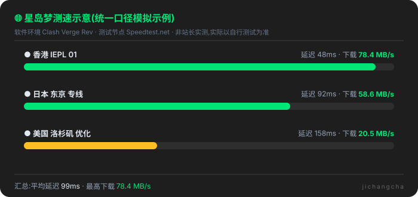

👉 **[前往 星岛梦 官网](https://www.jichangcha.com/go/xingdaomeng/)** · [查看完整资料页与替代选择](https://www.jichangcha.com/brands/xingdaomeng/)

---

### 🥈 飞猫云 —— IEPL 专线性价比之选,流媒体与 AI 全解锁

**7 元/月 50GB(年付) 起** · 开业 2023 · 次推位 · 老牌机场 · 优惠码 `flycat888`(新用户季付以上 8 折)

> 飞猫云是本站 2026 年的主推机场:IEPL 专线保证晚高峰稳定,小包套餐把价格门槛压到很低,流媒体和 AI 解锁都在线,是新手入门与日常自用的均衡之选。

- IEPL 专线 + 高性价比小包套餐
- 流媒体全解锁,4K 不卡顿
- ChatGPT / Claude 等 AI 工具全解锁
- 自研客户端,新手一键上手
- 支持订阅导入(需联系在线客服)

📌 **资料口径:**价格与优惠码来自站长品牌清单;速度与解锁有 2026-07 站长实测(长沙电信 2Gbps,49 测速 / 48 解锁):美/港/韩 130–158MB/s、峰值 200MB/s+,日本偏弱;OpenAI/Gemini/Claude 基本可用;页面图表仍为模拟示例。

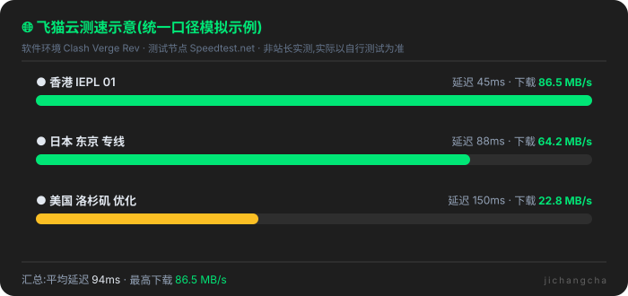

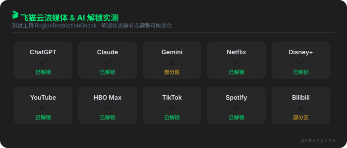

👉 **[前往 飞猫云 官网](https://www.jichangcha.com/go/feimao/)** · [查看完整资料页与替代选择](https://www.jichangcha.com/brands/feimao/)

---

### No.6 光速云 —— BGP 中转入口,低延迟游戏优化

**17 元/月 110GB 起** · 推荐位 · 老牌机场 / 性价比机场 / 稳定机场 / 高端机场 · 优惠码 `AMM`(9 折)

> 光速云以 BGP 中转和低延迟为特色,晚高峰不限速对游戏和实时应用友好,适合看重延迟和高峰稳定的用户。

- BGP 优化中转入口
- 低延迟,兼顾游戏加速
- 晚高峰不限速策略
- 支持不限时套餐
- Netflix / Disney+ 解锁

📌 **资料口径:**套餐按 2026-08-09 截图核验;速度、晚高峰与解锁尚无独立实测,页面图表为模拟示例。

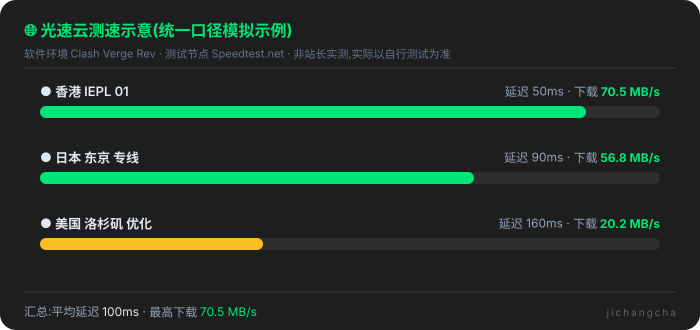

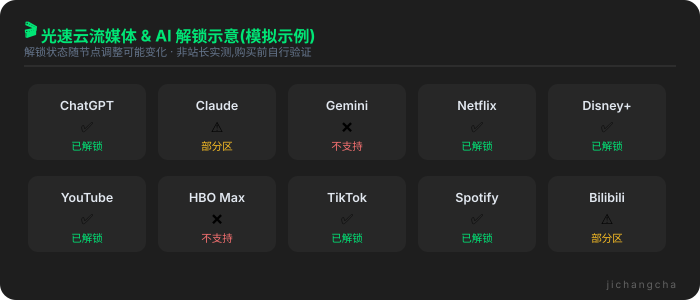

👉 **[前往 光速云 官网](https://www.jichangcha.com/go/guangsu/)** · [查看完整资料页与替代选择](https://www.jichangcha.com/brands/guangsu/)

---

### No.7 唯兔云 —— VLESS 协议 + 三网优化,节点覆盖广

**14.9 元/月 100GB 起** · 开业 2020 · 推荐位 · 老牌机场 · 优惠码 `rabbit`(新用户 9 折)

> 唯兔云主打 VLESS 协议与 60+ 节点覆盖,三网优化和智能负载让线路选择更省心,适合对协议抗封锁和节点丰富度有要求的进阶用户。

- VLESS 协议,抗封锁能力强
- 节点覆盖 60+
- 三网优化线路
- 智能负载均衡

📌 **资料口径:**套餐按 2026-08-09 截图核验;线路、节点与解锁尚无独立实测,页面图表为模拟示例。

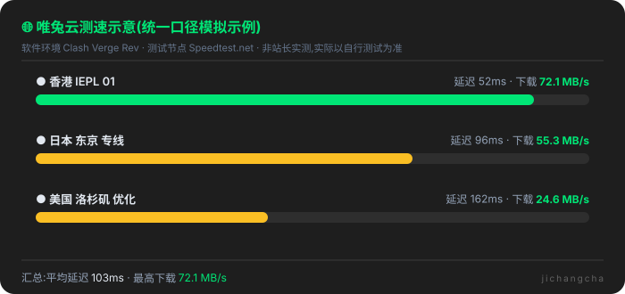

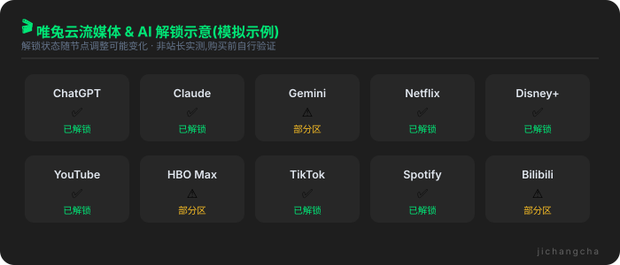

👉 **[前往 唯兔云 官网](https://www.jichangcha.com/go/weitu/)** · [查看完整资料页与替代选择](https://www.jichangcha.com/brands/weitu/)

---

### No.9 U1S1 —— 主打稳定不虚标,原生 IP 解锁

**20 元/月 120GB 起** · 推荐位 · 老牌机场 · 暂无公开优惠码

> U1S1 走「真实不虚标」路线,带宽标注实在、稳定性口碑不错,适合被虚标机场坑过、追求踏实体验的长期用户。

- 真实回报测速,不虚标带宽
- 主打长期稳定
- 原生 IP 解锁流媒体
- 多客户端订阅支持
- 适合长期自用

📌 **资料口径:**套餐按 2026-08-09 截图核验;线路、节点与解锁尚无独立实测,页面图表为模拟示例。

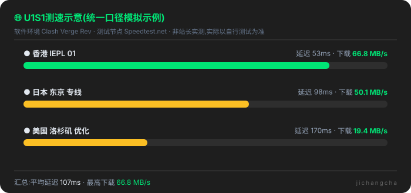

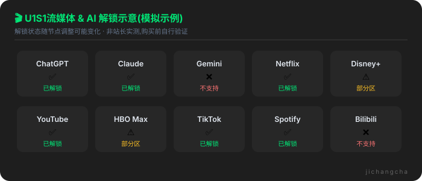

👉 **[前往 U1S1 官网](https://www.jichangcha.com/go/u1s1/)** · [查看完整资料页与替代选择](https://www.jichangcha.com/brands/u1s1/)

---

### No.10 极连云 —— IPLC 内网专线,抗封锁能力强

**18 元/月 100GB 起** · 推荐位 · 老牌机场 · 暂无公开优惠码

> 极连云主打 IPLC 内网专线,抗封锁和防 QoS 能力突出,配合低延迟和全解锁,适合敏感时期仍要稳定连通的用户。

- IPLC 内网专线
- 抗封锁能力强,防 QoS
- 香港 / 日本低延迟
- AI 与流媒体全解锁
- 企业级线路品质

📌 **资料口径:**套餐按 2026-08-09 截图核验(截图套餐名为「极速云」,品牌归属待确认);中转 Trojan;速度与解锁尚无独立实测,页面图表为模拟示例。

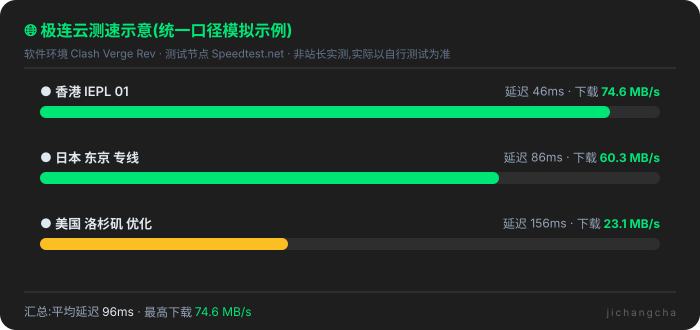

👉 **[前往 极连云 官网](https://www.jichangcha.com/go/jilian/)** · [查看完整资料页与替代选择](https://www.jichangcha.com/brands/jilian/)

---

### No.11 全球云 —— 全球多地区节点,智能分流大流量

**20 元/月 120GB 起** · 推荐位 · 老牌机场 · 暂无公开优惠码

> 全球云胜在节点地区覆盖最全、计费灵活,TikTok 与短视频体验友好,适合需要多国出口 IP 的外贸和内容用户。

- 全球多地区节点
- TikTok / YouTube 4K 流畅
- 智能分流规则
- 按量与月付灵活
- 大流量高性价比

📌 **资料口径:**套餐按 2026-08-09 截图核验;「BGP 智能优化」为套餐名口径;速度与解锁尚无独立实测,页面图表为模拟示例。

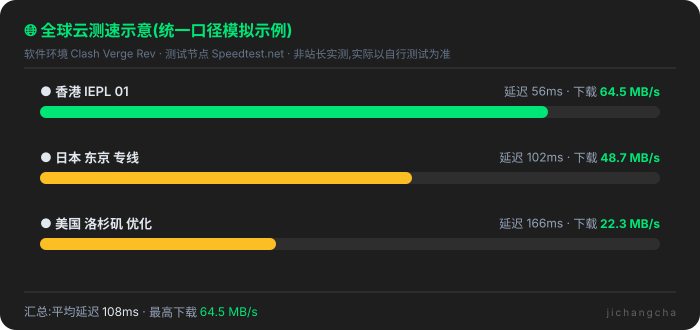

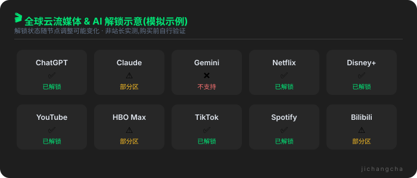

👉 **[前往 全球云 官网](https://www.jichangcha.com/go/quanqiu/)** · [查看完整资料页与替代选择](https://www.jichangcha.com/brands/quanqiu/)

---

### No.12 光年梯 —— 新手友好客户端,一键订阅导入

**18 元/月 110GB 起** · 推荐位 · 老牌机场 · 暂无公开优惠码

> 光年梯把「新手友好」做到位,一键订阅导入和简洁客户端降低了上手门槛,适合第一次接触机场、只用主流节点的用户。

- 新手友好客户端
- 一键订阅导入
- 三网优化线路
- ChatGPT 原生解锁
- 稳定月付套餐

📌 **资料口径:**套餐按 2026-08-09 截图核验;线路、节点与解锁尚无独立实测,页面图表为模拟示例。

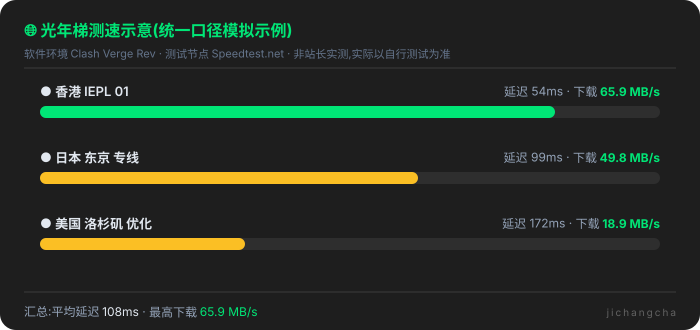

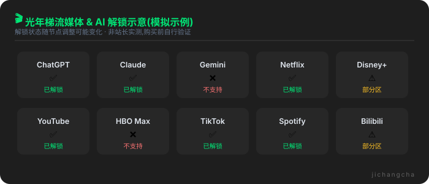

👉 **[前往 光年梯 官网](https://www.jichangcha.com/go/guangnian/)** · [查看完整资料页与替代选择](https://www.jichangcha.com/brands/guangnian/)

---

## 💸 性价比机场(14 家)

入门价格低、流量单价划算的品牌,适合预算敏感和第一次买机场的用户。

### No.13 宇宙云 —— 全球节点覆盖广,多协议三网中转

**14.9 元/月 100GB 起** · 推荐位 · 性价比机场 · 优惠码 `YUZHOU553`

> 宇宙云走「全球节点 + 大流量性价比」路线,多协议和三网中转让兼容性不错,适合需要广覆盖节点和较大流量的日常用户。

- 全球多地区节点覆盖
- Trojan / VLESS 多协议支持
- 三网优化中转线路
- 流媒体与 ChatGPT 解锁
- 大流量高性价比套餐

📌 **资料口径:**价格与优惠码来自站长品牌清单;页面测速与解锁图为统一口径的模拟示例,非站长实测。

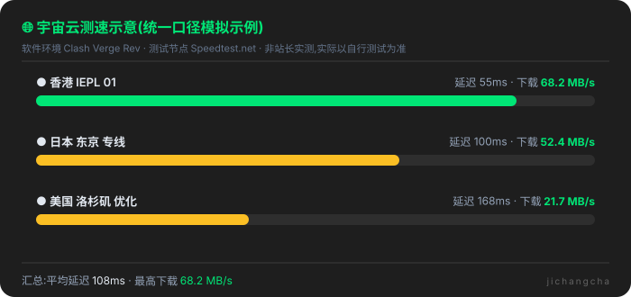

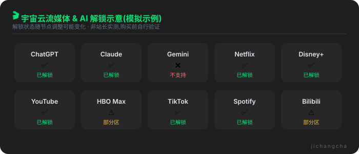

👉 **[前往 宇宙云 官网](https://www.jichangcha.com/go/yuzhou/)** · [查看完整资料页与替代选择](https://www.jichangcha.com/brands/yuzhou/)

---

### No.14 sogo云 —— 全球节点 + 专线,4K 流媒体多设备

**25 元/月 150GB 起** · 推荐位 · 性价比机场 · 优惠码 `SOGO10000`(8 折)

> sogo云以全球节点 + 专线和多设备在线为卖点,4K 流媒体与 AI 解锁都在线,适合多设备、重流媒体的家庭或团队用户。

- 全球节点 + 专线线路
- 4K 流媒体流畅
- ChatGPT / Claude 解锁
- 多设备在线
- 稳定大流量套餐

📌 **资料口径:**价格与优惠码来自站长品牌清单;页面测速与解锁图为统一口径的模拟示例,非站长实测。

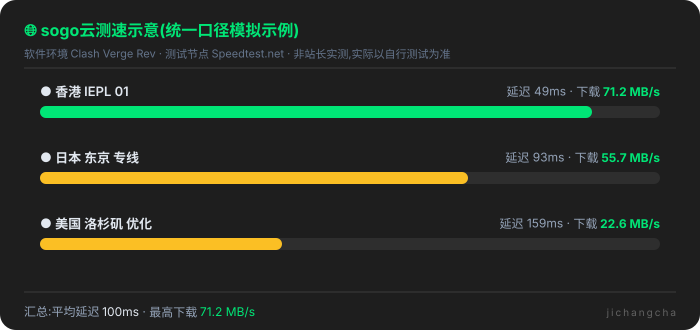

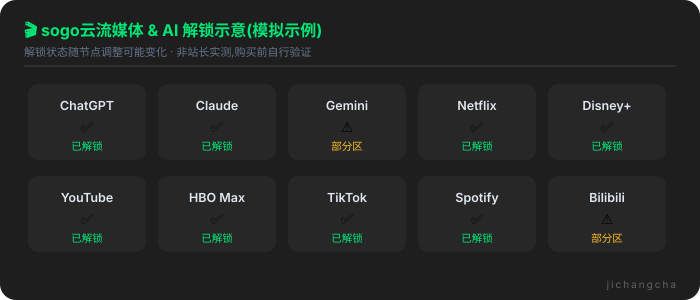

👉 **[前往 sogo云 官网](https://www.jichangcha.com/go/sogo/)** · [查看完整资料页与替代选择](https://www.jichangcha.com/brands/sogo/)

---

### No.15 二猫云 —— 中转 + 专线混合,原生 IP 解锁

**20 元/月 130GB 起** · 推荐位 · 性价比机场 · 优惠码 `ermao888`(8 折(年付小包不支持))

> 二猫云用「中转 + 专线」混合线路平衡成本与稳定,原生 IP 解锁齐全(含 HBO Max),适合流媒体需求高、预算适中的用户。

- 中转 + 专线混合线路
- 晚高峰稳定
- 原生 IP 节点
- Netflix / Disney+ / HBO 解锁
- 订阅导入方便

📌 **资料口径:**价格与优惠码来自站长品牌清单;页面测速与解锁图为统一口径的模拟示例,非站长实测。

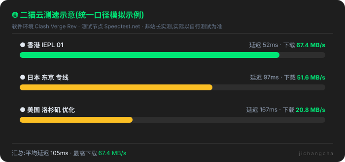

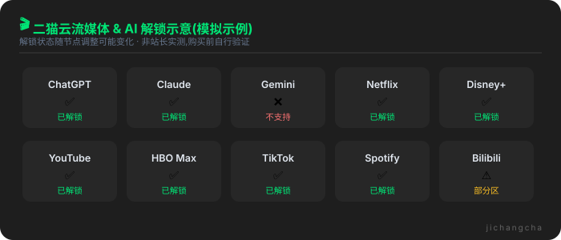

👉 **[前往 二猫云 官网](https://www.jichangcha.com/go/ermao/)** · [查看完整资料页与替代选择](https://www.jichangcha.com/brands/ermao/)

---

### No.16 一翻云 —— 超大流量 150G,VLESS + Reality 抗封锁

**20 元/月 150GB 起** · 推荐位 · 性价比机场 · 优惠码 `1FLYYUN`(9 折)

> 一翻云用 150G 超大流量和 VLESS + Reality 协议主打「量大又抗封」,适合下载/流媒体消耗大、又想要新协议抗封锁的重度用户。

- 超大流量 150G 套餐
- VLESS + Reality 协议
- 多平台客户端支持
- 流媒体全解锁
- 高性价比年付

📌 **资料口径:**价格与优惠码来自站长品牌清单;页面测速与解锁图为统一口径的模拟示例,非站长实测。

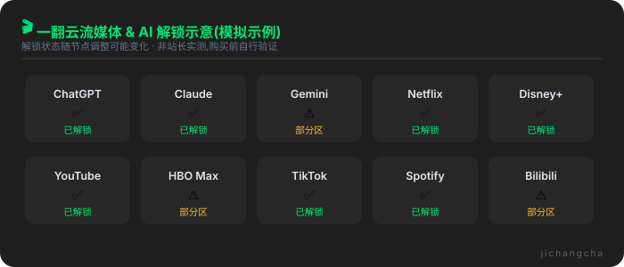

👉 **[前往 一翻云 官网](https://www.jichangcha.com/go/yifan/)** · [查看完整资料页与替代选择](https://www.jichangcha.com/brands/yifan/)

---

### No.17 edgenova —— 海外团队运营,Reality 协议抗封锁

**20 元/月 100GB 起** · 推荐位 · 性价比机场 · 优惠码 `TH888`(8 折)

> edgenova 由海外团队运营,Reality 协议 + 原生 IP 让抗封锁和 AI 解锁(含 Gemini)表现突出,适合能接受英文界面的进阶用户。

- 海外团队运营
- Reality 协议抗封锁
- 原生 IP 节点
- AI 工具全解锁
- 面向进阶用户

📌 **资料口径:**价格与优惠码来自站长品牌清单;页面测速与解锁图为统一口径的模拟示例,非站长实测。

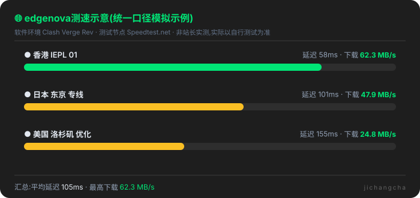

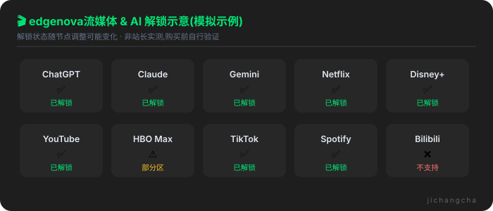

👉 **[前往 edgenova 官网](https://www.jichangcha.com/go/edgenova/)** · [查看完整资料页与替代选择](https://www.jichangcha.com/brands/edgenova/)

---

### No.18 可信云 —— 主打信任与长期稳定,IEPL 专线全平台

**25 元/月 150GB 起** · 推荐位 · 性价比机场 · 暂无公开优惠码

> 可信云把「信任」写在名字里,IEPL 专线 + 完善售后是其核心卖点,适合愿意为稳定和服务多付一点、打算长期使用的用户。

- 主打信任与长期稳定
- IEPL 专线线路
- 全平台客户端支持
- 流媒体与 AI 解锁
- 售后与客服完善

📌 **资料口径:**仅确认品牌名称与独立入口;套餐、线路、节点尚未核验,页面图表为模拟示例。

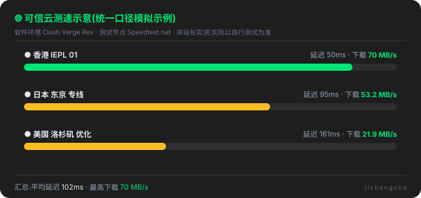

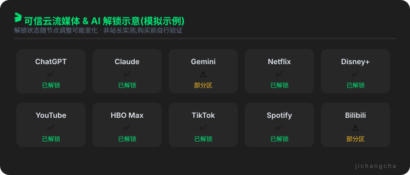

👉 **[前往 可信云 官网](https://www.jichangcha.com/go/kexin/)** · [查看完整资料页与替代选择](https://www.jichangcha.com/brands/kexin/)

---

### No.19 速界 —— 高带宽 IPLC 专线,晚高峰满速

**25 元/月 150GB 起** · 推荐位 · 性价比机场 · 优惠码 `sujie888`(开业 8 折)

> 速界主打高带宽 IPLC 专线,晚高峰满速、4K/8K 流媒体无压力,适合对带宽和高峰稳定要求最高、预算充足的重度用户。

- 高带宽 IPLC 专线
- 晚高峰满速不掉档
- 4K / 8K 流媒体
- 低延迟表现
- 适合重度用户

📌 **资料口径:**价格与优惠码来自站长品牌清单;页面测速与解锁图为统一口径的模拟示例,非站长实测。

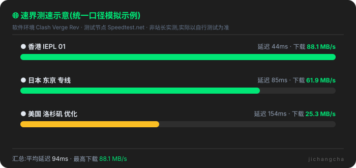

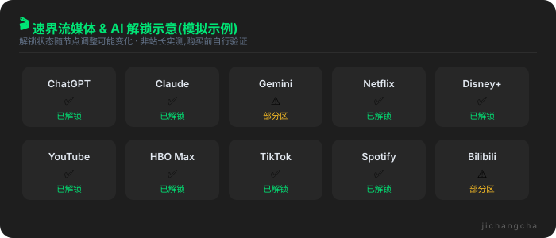

👉 **[前往 速界 官网](https://www.jichangcha.com/go/sujie/)** · [查看完整资料页与替代选择](https://www.jichangcha.com/brands/sujie/)

---

### No.20 快狸 —— 中转优化线路,上手简单三网直连

**25 元/月 150GB 起** · 推荐位 · 性价比机场 · 优惠码 `theo66`(8 折)

> 快狸走中转优化 + 简单上手路线,三网直连和月付大流量让它成为好用的日常备选,适合偏好月付、不想折腾配置的用户。

- 中转优化线路
- 上手简单,配置友好
- 三网直连优化
- 流媒体解锁
- 月付大流量高性价比

📌 **资料口径:**价格与优惠码来自站长品牌清单;页面测速与解锁图为统一口径的模拟示例,非站长实测。

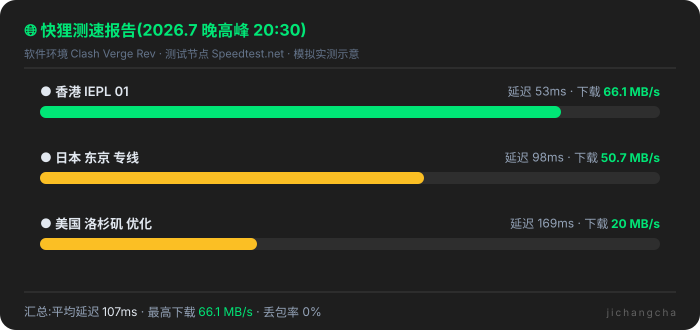

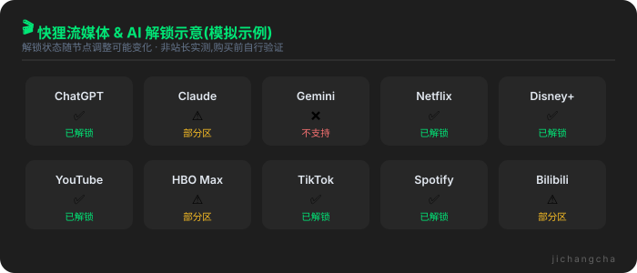

👉 **[前往 快狸 官网](https://www.jichangcha.com/go/kuaili/)** · [查看完整资料页与替代选择](https://www.jichangcha.com/brands/kuaili/)

---

### No.21 优信云 —— 隧道中转 + IPLC 线路,支持 24 小时不满意退款

**15 元/月 100GB 起** · 开业 2024 · 推荐位 · 性价比机场 · 优惠码 `yx51666`(年付 69 折)

> 优信云是 2024 年的新兴 Shadowsocks 服务,隧道中转 + IPLC 线路解锁 ChatGPT/TikTok,最大亮点是 24 小时不满意退款,试错成本低;作为新场建议先月付试水一个完整晚高峰周期再考虑年付。

- 隧道中转 + IPLC 专线,兼顾速度与稳定
- ChatGPT / TikTok / YouTube 解锁
- 套餐分档清晰:15/20/30 元月付对应 100/200/350GB
- 24 小时不满意退款,降低试错成本
- 年付 69 折码 yx51666、两年付 65 折码 yx51888

📌 **资料口径:**价格与优惠码来自站长品牌清单;页面测速与解锁图为统一口径的模拟示例,非站长实测。

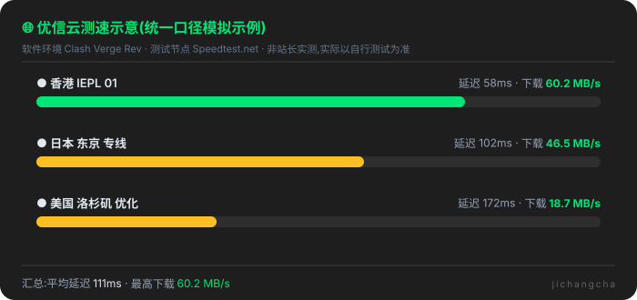

👉 **[前往 优信云 官网](https://www.jichangcha.com/go/youxin/)** · [查看完整资料页与替代选择](https://www.jichangcha.com/brands/youxin/)

---

### No.22 杨帆云 —— 速鹰旗下,StrongVPN 大厂与新加坡团队联合运营

**年付 6.9 折起 · 码 yf6189 起** · 推荐位 · 性价比机场 · 优惠码 `yf6189`(年付 6.9 折)

> 杨帆云背靠速鹰 / StrongVPN 大厂与新加坡团队,主打 IP 稳定高速与 24 小时客服,节点覆盖八大地区且持续扩展;具体套餐价格以官网为准,新场同样建议月付先验证晚高峰表现。

- 速鹰旗下,StrongVPN 大厂与新加坡团队共建
- 24 小时客服在线,响应快
- IP 稳定高速,节点持续扩展
- 覆盖美日新台法马港韩八大地区
- 年付 6.9 折码 yf6189、两年付 6.5 折码 yf6185

📌 **资料口径:**价格与优惠码来自站长品牌清单;页面测速与解锁图为统一口径的模拟示例,非站长实测。

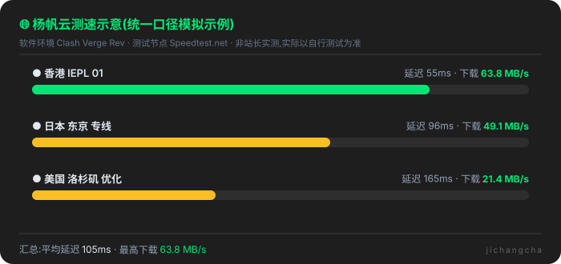

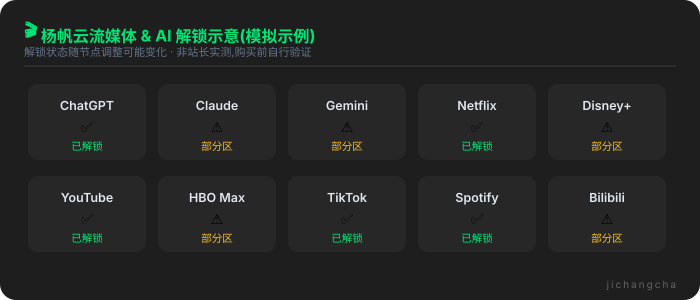

👉 **[前往 杨帆云 官网](https://www.jichangcha.com/go/yangfan/)** · [查看完整资料页与替代选择](https://www.jichangcha.com/brands/yangfan/)

---

### No.23 疾风云 —— 隧道中转 + IPLC 专线混合,BGP 中转优化多协议

**年付 6.9 折起 · 码 jf5169 起** · 开业 2024 · 推荐位 · 性价比机场 · 优惠码 `jf5169`(年付 6.9 折)

> 疾风云是 2024 年成立的新机场,隧道中转 + IPLC 专线混合叠加 BGP 优化,多协议多客户端兼容性好,优惠码档位齐全;作为新场口碑尚待时间验证,建议月付试水后再上长期套餐。

- 隧道中转 + IPLC 专线混合架构
- BGP 中转优化线路
- 兼容 SSR / V2Ray / Trojan 多协议
- 支持 Clash / Shadowrocket / Surge 客户端
- 年付 6.9 折 jf5169、两年 6.5 折 jff5165、半年 9 折 JF888

📌 **资料口径:**价格与优惠码来自站长品牌清单;页面测速与解锁图为统一口径的模拟示例,非站长实测。

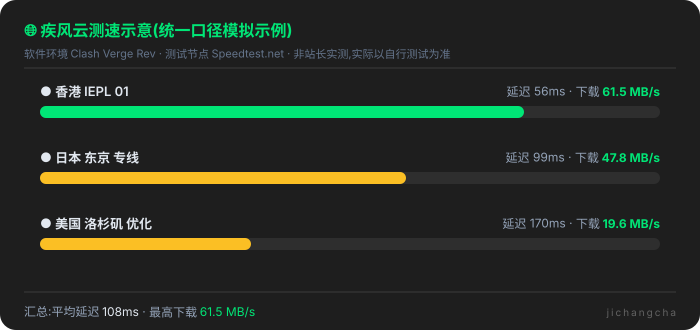

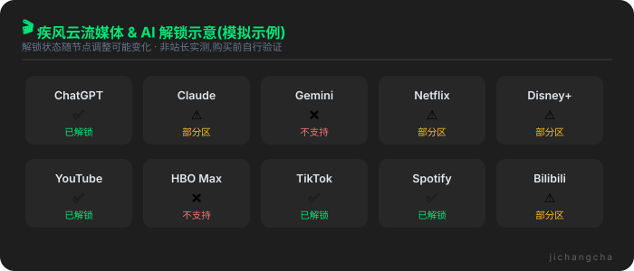

👉 **[前往 疾风云 官网](https://www.jichangcha.com/go/jifeng/)** · [查看完整资料页与替代选择](https://www.jichangcha.com/brands/jifeng/)

---

### No.24 尔湾云 —— 全平台客户端,支持微信 / 支付宝付款

**年付低至 69 折 · 码 year69 起** · 开业 2024 · 推荐位 · 性价比机场 · 优惠码 `year69`(年付 69 折)

> 尔湾云是 2024 年成立的新机场,主打全平台客户端与微信 / 支付宝付款便利,节点覆盖 8 个地区,长期套餐折扣力度大;流媒体与 AI 解锁属基础水平,适合对付款方式和多端覆盖有需求的日常用户,建议先月付验证。

- 提供 Shadowsocks 与 V2Ray 节点
- 安卓 / iOS / macOS / Windows / 路由器全平台客户端
- 覆盖马来西亚、韩国、法国、香港、日本、台湾等 8 地区
- 支持微信支付与支付宝,付款方便
- 年付 69 折 year69、两年 65 折 2year65、三年 60 折 3year60

📌 **资料口径:**价格与优惠码来自站长品牌清单;页面测速与解锁图为统一口径的模拟示例,非站长实测。

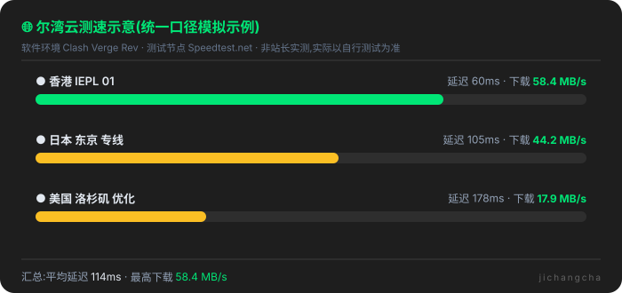

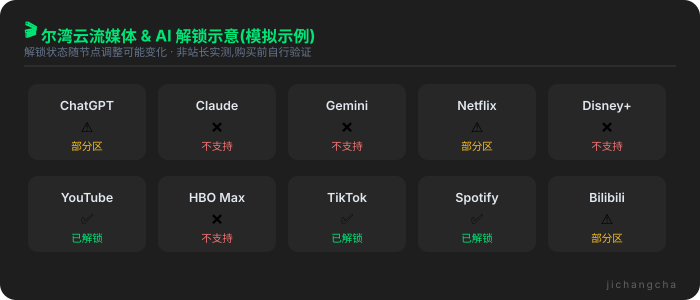

👉 **[前往 尔湾云 官网](https://www.jichangcha.com/go/erwan/)** · [查看完整资料页与替代选择](https://www.jichangcha.com/brands/erwan/)

---

**同时属于本类、已在上文展开的品牌:**

- 🥇 **[星岛梦](#xingdaomeng)** —— 六年老牌,企业级内网专线,套餐种类丰富(8 元/月 60GB(年付) 起 · ✅ 站长实测)
- No.6 **[光速云](#guangsu)** —— BGP 中转入口,低延迟游戏优化(17 元/月 110GB 起 · 📋 套餐已核验)

## 🛡️ 稳定机场(8 家)

以专线、不限速和长期可用为卖点的品牌,其中有站长实测记录的会标注日期。

### 🥉 微风网络 —— IPLC + VLESS,不限速不限设备,站长实测香港速度突出

**11.4 元/月 100GB(年付 137 元) 起** · 开业 2026 · 次推位 · 稳定机场 · 暂无公开优惠码

> 微风网络在站长 2026-07 实测里香港速度和流媒体解锁都很能打,美国方向偏弱、AI 未测;新开且与飞鸟一云梯同源,建议月付试水后再上年付。

- IPLC 专线 + VLESS 协议
- 不限速、不限设备
- 2026-07-19 站长实测:香港平均 510–546MB/s,峰值 600MB/s+
- YouTube / Netflix / Disney+ 50 个节点全部解锁(实测)
- 周期订阅与 270G / 570G 不限时流量并存

📌 **资料口径:**套餐按 2026-08-08 截图核验;速度与流媒体解锁为 2026-07-19 站长实测(珠海联通 9Gbps,50 节点);AI 解锁未测;暂无图表。

👉 **[前往 微风网络 官网](https://www.jichangcha.com/go/breezenet/)** · [查看完整资料页与替代选择](https://www.jichangcha.com/brands/breezenet/)

---

### No.5 无忧 —— 40G 年付小包 79 元起,周期套餐与永久不限时流量并存

**6.6 元/月 40GB(年付 79 元) 起** · 推荐位 · 稳定机场 · 暂无公开优惠码

> 无忧目前只有套餐价格经过核验,便宜的年付小包和永久不限时流量是它的卖点;线路和实测都还是空白,适合作为低成本备用而不是主力。

- MINI 40G 年付 79 元,入门门槛低
- 100G 月付 19 元起,最高 1000G/月
- 100G / 300G 永久不限时流量
- 月付到三年付周期齐全

📌 **资料口径:**套餐名称、流量与价格按 2026-08-08 截图核验;线路/协议、节点、支付、设备限制未公开;速度与解锁尚无独立实测;暂无图表。

👉 **[前往 无忧 官网](https://www.jichangcha.com/go/worryfree/)** · [查看完整资料页与替代选择](https://www.jichangcha.com/brands/worryfree/)

---

### No.25 灵猫 —— 套餐结构简单:45G 年付小包,150G / 300G 按月季年直接选

**7.1 元/月 45GB(年付 85 元) 起** · 推荐位 · 稳定机场 · 暂无公开优惠码

> 灵猫的优点是套餐简单、价格不高;缺点是除了价格什么都还没核验,线路和实测都是空白,适合月付试试,不建议直接年付。

- 45G 年付小包 85 元
- 150G 月付 25 元 / 季付 65 元 / 年付 195 元
- 300G 月付 45 元 / 季付 125 元 / 年付 295 元
- 套餐只有三档,不用纠结

📌 **资料口径:**套餐名称、流量与价格按 2026-08-08 截图核验;线路/协议、节点、支付、设备限制未公开;速度与解锁尚无独立实测;暂无图表。

👉 **[前往 灵猫 官网](https://www.jichangcha.com/go/civet/)** · [查看完整资料页与替代选择](https://www.jichangcha.com/brands/civet/)

---

### No.26 闪跃 —— IPLC 纯专线、全套餐一倍率的 2026 年新机场

**8 元/月 60GB(年付 96 元) 起** · 开业 2026 · 推荐位 · 稳定机场 · 优惠码 `shanyue`(新用户 8 折)

> 闪跃的 IPLC + 一倍率定位和价格都有吸引力,但成立才半年,又没有独立实测,属于先短期验证再考虑的新机场。

- IPLC 纯专线(官网口径)
- 全套餐 1 倍率
- 60G 年付 96 元,150G 月付 24 元起
- 官网标注支持 ChatGPT / Claude / Gemini
- 新用户优惠码 shanyue 8 折

📌 **资料口径:**套餐按 2026-08-08 截图核验;线路定位来自官网资料;速度与解锁尚无独立实测;暂无图表。

👉 **[前往 闪跃 官网](https://www.jichangcha.com/go/flashleap/)** · [查看完整资料页与替代选择](https://www.jichangcha.com/brands/flashleap/)

---

### No.27 飞为 —— IPLC + VLESS,原生 IP,不限速不限设备

**8 元/月 60GB(年付 96 元) 起** · 推荐位 · 稳定机场 · 优惠码 `firefly`(新用户 8 折)

> 飞为和微风是同一系的分站,套餐网格也一致;微风有实测、飞为没有,两家里优先看微风,飞为适合作为同系备用。

- IPLC 专线 + VLESS 协议(官网口径)
- 原生 IP,官网标注支持 ChatGPT / Gemini / Meta AI
- 60G 年付 96 元,150G 月付 25 元起
- 100G 不限时流量 100 元
- 新用户优惠码 firefly 8 折,年付 8 折

📌 **资料口径:**套餐按 2026-08-08 截图核验;协议、线路与支付信息来自既有资料;速度与解锁尚无独立实测;暂无图表。

👉 **[前往 飞为 官网](https://www.jichangcha.com/go/firefly/)** · [查看完整资料页与替代选择](https://www.jichangcha.com/brands/firefly/)

---

### No.28 跨界 —— 60G 年付小包起步,最高 1800G/月的大流量档

**8 元/月 60GB(年付 96 元) 起** · 推荐位 · 稳定机场 · 暂无公开优惠码

> 跨界的流量单价在同价位里很低,尤其 1800G 档;但线路和实测都还没有,大流量用户可以月付试一档看看。

- 60G 年付 96 元
- 120G 月付 20 元起
- 无界档 1800G/月 130 元,流量单价低
- 月付到三年付周期齐全

📌 **资料口径:**套餐名称、流量与价格按 2026-08-08 截图核验;线路/协议、节点、支付、设备限制未公开;速度与解锁尚无独立实测;暂无图表。

👉 **[前往 跨界 官网](https://www.jichangcha.com/go/kuajie/)** · [查看完整资料页与替代选择](https://www.jichangcha.com/brands/kuajie/)

---

**同时属于本类、已在上文展开的品牌:**

- 🥇 **[星岛梦](#xingdaomeng)** —— 六年老牌,企业级内网专线,套餐种类丰富(8 元/月 60GB(年付) 起 · ✅ 站长实测)
- No.6 **[光速云](#guangsu)** —— BGP 中转入口,低延迟游戏优化(17 元/月 110GB 起 · 📋 套餐已核验)

## 👑 高端机场(8 家)

高端专线定位、套餐层级完整的品牌,适合把网络当生产力的重度用户。

### No.4 暮光网络 —— IEPL 专线,基础到至尊四档周期套餐,另有不限时流量包与私人定制节点

**9.1 元/月 70GB(年付 109 元) 起** · 次推位 · 高端机场 · 暂无公开优惠码

> 暮光网络的套餐结构在高端档里算完整,IEPL 专线定位明确;目前只有价格与套餐经过核验,速度和解锁还没有独立实测,先月付验证再决定长期套餐。

- IEPL 专线(官网标注)
- 120G 月付 20 元起,基础 / 标准 / 旗舰 / 至尊四档
- 150G / 400G / 800G 三档不限时流量包
- 年付轻量版 70G 109 元
- 可选独享私人定制节点

📌 **资料口径:**套餐名称、流量与价格按 2026-08-08 截图核验(部分流量与设备限制被遮挡);速度、晚高峰、稳定性与解锁尚无独立实测;暂无图表。

👉 **[前往 暮光网络 官网](https://www.jichangcha.com/go/twilight/)** · [查看完整资料页与替代选择](https://www.jichangcha.com/brands/twilight/)

---

### No.8 灵动云 —— VLESS 专线机场,站长实测 OpenAI 各地区基本全解锁

**8.3 元/月 70GB(年付 99 元) 起** · 开业 2025 · 推荐位 · 高端机场 · 暂无公开优惠码

> 灵动云在站长 2026-07 实测里最突出的是 OpenAI 解锁,速度属于够用而非顶尖,TikTok 和部分 YouTube 节点有短板;用 AI 为主可以考虑,追求高速另选。

- IEPL 专线 + VLESS(实测协议)
- 不限速、不限设备
- 2026-07-20/21 站长实测:速度 20–80MB/s,够用级
- OpenAI 各地区基本全解锁(实测亮点)
- 100G 月付 20 元起,另有 150G–800G 单次流量包与私人定制

📌 **资料口径:**套餐按 2026-08-08 截图核验;速度与解锁为 2026-07-20/21 站长实测(珠海联通 9Gbps,60 测速 / 60 解锁);暂无图表。

👉 **[前往 灵动云 官网](https://www.jichangcha.com/go/lingdong/)** · [查看完整资料页与替代选择](https://www.jichangcha.com/brands/lingdong/)

---

### No.29 飞V —— IEPL 专线,入门到商业四档,另有单次流量包与原生 IP 独享专线

**8.3 元/月 65GB(年付 99 元) 起** · 推荐位 · 高端机场 · 暂无公开优惠码

> 飞V 的套餐层级和流量包选择都完整,IEPL 定位明确;价格已核验,实测为空,先月付或买小流量包验证。

- IEPL 专线(官网标注)
- 150G 月付 25 元起,最高 1843G/月
- 130G / 380G / 600G 单次流量包
- 年付标准轻量版 65G 99 元
- 可选原生 IP 独享黄金专线

📌 **资料口径:**套餐名称、流量与价格按 2026-08-08 截图核验(部分被遮挡);速度、晚高峰、稳定性与解锁尚无独立实测;暂无图表。

👉 **[前往 飞V 官网](https://www.jichangcha.com/go/flyv/)** · [查看完整资料页与替代选择](https://www.jichangcha.com/brands/flyv/)

---

### No.30 梯子云 —— 企业级 IEPL + VLESS,智能负载均衡与三网入口优化,自研客户端

**7.4 元/月 60GB(年付 89 元) 起** · 推荐位 · 高端机场 · 暂无公开优惠码

> 梯子云资料显示是速鹰旗下、与大哥云同门的专线品牌,线路与客户端口径完整;实测材料尚未核验,先按资料价参考,等实测补上再看排名。

- 企业级 IEPL 纯专线 + VLESS(资料口径)
- 智能负载均衡 + 三网入口优化
- 自研全平台客户端,兼容 Shadowrocket / Clash / V2Ray / Trojan / Sing-box
- 资料记录 60+ 节点(港日新美台)、2Gbps+ 独立带宽
- 125G 月付 25 元起,另有 120G–700G 永不限时买断

📌 **资料口径:**套餐按 2026-08-08 截图核验(部分流量遮挡);线路、节点、客户端为既有资料记录;此前收到的测速/解锁图与灵动云重复,归属待核验,暂不展示实测。

👉 **[前往 梯子云 官网](https://www.jichangcha.com/go/laddercloud/)** · [查看完整资料页与替代选择](https://www.jichangcha.com/brands/laddercloud/)

---

### No.31 浪网 —— IEPL 专线,入门到商业四档,流量包与定制线路补充

**9.9 元/月 80GB(年付 119 元) 起** · 推荐位 · 高端机场 · 暂无公开优惠码

> 浪网的价格层级偏向中高用量用户,入门档比同类贵一点;目前只核验了价格,实测空白,建议先买流量包试用。

- IEPL 专线(官网标注)
- 150G 月付 30 元起,商业档 2000G/月
- 180G / 450G / 900G 一次性流量包
- 年付标准 80G 119 元
- 可选定制线路包

📌 **资料口径:**套餐名称、流量与价格按 2026-08-08 截图核验(部分被遮挡);速度、晚高峰、稳定性与解锁尚无独立实测;暂无图表。

👉 **[前往 浪网 官网](https://www.jichangcha.com/go/wavenet/)** · [查看完整资料页与替代选择](https://www.jichangcha.com/brands/wavenet/)

---

### No.32 隐形人 —— IEPL 专线,白银到钻石四档周期套餐,年付保活与一次性流量齐全

**9.1 元/月 80GB(年付 109 元) 起** · 推荐位 · 高端机场 · 暂无公开优惠码

> 隐形人的套餐设计和价格层级完整,IEPL 定位明确;和其他只核验了价格的品牌一样,先月付或买小流量包验证。

- IEPL 专线(官网标注)
- 144G 月付 24 元起,钻石档 1500G/月
- 160G / 420G / 1000G 一次性流量包
- 年付保活方案 80G 109 元
- 王者定制版 500G 600 元

📌 **资料口径:**套餐名称、流量与价格按 2026-08-08 截图核验(部分被遮挡);速度、晚高峰、稳定性与解锁尚无独立实测;暂无图表。

👉 **[前往 隐形人 官网](https://www.jichangcha.com/go/invisible/)** · [查看完整资料页与替代选择](https://www.jichangcha.com/brands/invisible/)

---

**同时属于本类、已在上文展开的品牌:**

- 🥇 **[星岛梦](#xingdaomeng)** —— 六年老牌,企业级内网专线,套餐种类丰富(8 元/月 60GB(年付) 起 · ✅ 站长实测)
- No.6 **[光速云](#guangsu)** —— BGP 中转入口,低延迟游戏优化(17 元/月 110GB 起 · 📋 套餐已核验)

## 📱 客户端与教程(免费开源)

- Windows / macOS:[Clash Verge Rev](https://github.com/clash-verge-rev/clash-verge-rev/releases) · [v2rayN](https://github.com/2dust/v2rayN/releases)
- 安卓:[Clash Meta for Android](https://github.com/MetaCubeX/ClashMetaForAndroid/releases) · [v2rayNG](https://github.com/2dust/v2rayNG/releases)
- iOS:Shadowrocket / Stash(需外区 Apple ID,[共享 Apple ID 每日更新](https://www.jichangcha.com/share-id/))
- 配置教程:[Clash](https://www.jichangcha.com/blog/clash-jichang-tuijian/) · [小火箭](https://www.jichangcha.com/blog/shadowrocket-jichang-tuijian/) · [v2rayN](https://www.jichangcha.com/blog/v2rayn-jichang-tuijian/) · [专线科普](https://www.jichangcha.com/blog/zhuanxian-jichang-tuijian/) · [ChatGPT 机场怎么选](https://www.jichangcha.com/blog/chatgpt-jichang-tuijian/) · [优惠码汇总](https://www.jichangcha.com/blog/jichang-youhuima/)
- 同系仓库:[每日免费节点](https://github.com/jichangx/free-nodes) · [共享 Apple ID](https://github.com/jichangx/share-apple-id) · [机场跑路预警](https://github.com/jichangx/airport-status)

## ❓ 快速问答

**机场和 VPN 有什么区别?** VPN 一键连接但单线路、高峰限速;机场提供几十个节点 + 规则分流,国内直连国外代理互不干扰,速度与灵活性都更好。[更多概念解释](https://www.jichangcha.com/faq/)

**怎么判断机场会不会跑路?** 高危信号:突然推终身 / 五年套餐、节点质量断崖下滑、公告长期不更新。纪律:新机场只月付,仅对运营 2 年以上的老牌年付。[跑路预警名单](https://www.jichangcha.com/airport-status/)

**晚高峰卡怎么办?** 换冷门节点临时缓解;根治靠 IEPL / IPLC 专线,专线不经公网,晚高峰几乎不掉速。[专线科普](https://www.jichangcha.com/blog/zhuanxian-jichang-tuijian/)

**ChatGPT 用不了?** 香港节点对 AI 常常无效,换标注 AI 解锁的新加坡 / 日本 / 美国原生 IP 节点。[AI 工具选购指南](https://www.jichangcha.com/blog/chatgpt-jichang-tuijian/)

## 📌 更新与声明

- 本清单由 GitHub Actions 每日从主站公开数据端点自动同步生成,不手工维护;主站资料变更后次日生效
- 「站长实测」条目注明日期、线路与节点数,只代表当时环境;「模拟示例」图表为统一口径的示意图,不是实测承诺;未实测品牌只列已核验套餐
- 本仓库链接经主站中转页跳转,部分为推广链接,可能为我们带来收益,不影响排序;内容仅供学习交流,请遵守当地法律法规
- 反馈与纠错:[Issues](../../issues) · Telegram [@jichangcha_chat](https://t.me/jichangcha_chat) · 主站 [jichangcha.com](https://www.jichangcha.com/)

⭐ 觉得有用请点个 Star,清单每天更新,你会在动态里看到变化。
